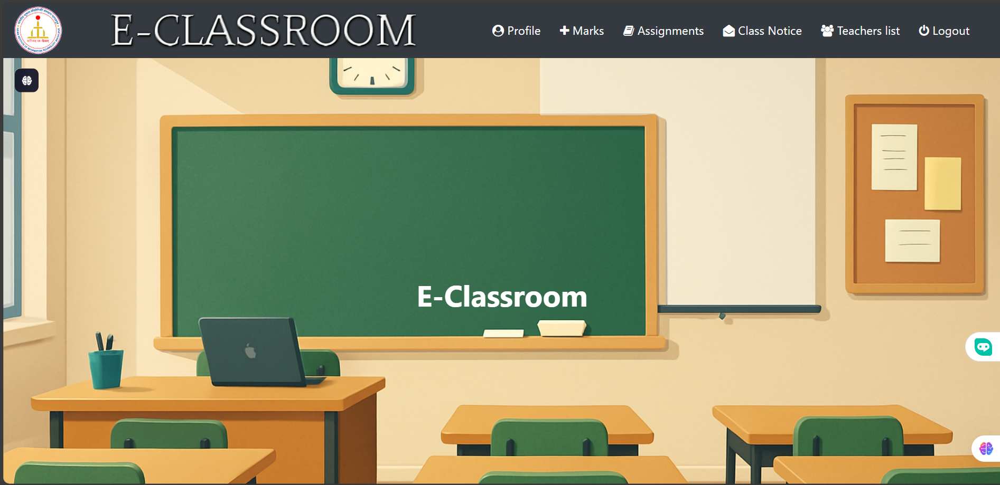
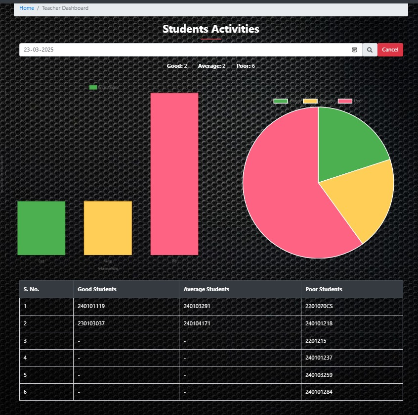
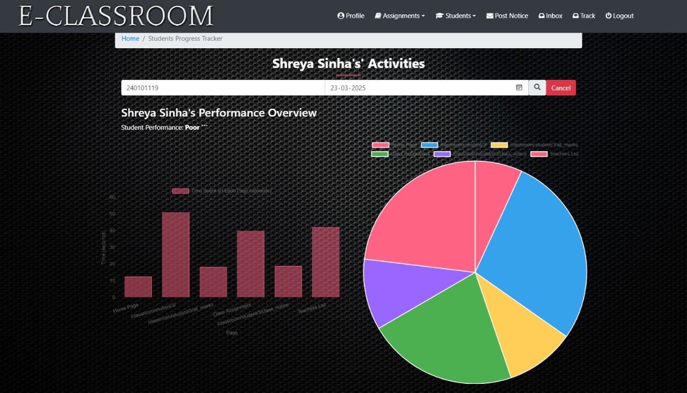

# 🏆 Student Progress Tracker (AI-Powered)  
**A Smart and AI-Driven Platform for Monitoring and Enhancing Student Performance**  

The **Student Progress Tracker** is an intelligent system designed to track, analyze, and visualize student performance efficiently. Using **AI-powered insights**, this platform helps educators and students assess academic growth, identify weak areas, and improve learning outcomes.  

📌 **Live Demo**: [Click Here](https://siddprogresstracker.pythonanywhere.com/)

---

## 🚀 Key Features  

✅ **AI-Based Performance Analysis** – Get AI-driven insights into student progress based on past performance.  
✅ **Personalized Student Dashboard** – Each student gets a dedicated profile with progress charts, reports, and performance insights.  
✅ **Attendance Tracking** – Automatically track attendance and generate insightful statistics.  
✅ **Automated Report Generation** – Generate PDF reports for student progress, attendance, and overall performance.  
✅ **Role-Based Access** – Separate dashboards for **students**, **teachers**, and **administrators**.  
✅ **Data Visualization** – Interactive charts and graphs for better performance analysis.  
✅ **Secure Authentication** – Uses email-based login and **Django authentication** to protect user data.  

---

## 📁 Project Structure  

The project is well-structured and modular for scalability and maintenance:  

📂 **students/** → Manages student profiles, attendance, and performance reports.  
📂 **teachers/** → Handles teacher accounts, student evaluations, and class management.  
📂 **classroom/** → Contains AI models, progress-tracking logic, and result analytics.  
📂 **templates/** → HTML templates for dashboards, student profiles, and analytics.  
📂 **static/** → CSS, JavaScript, and images for UI enhancements.  

---

## 🛠️ Technology Stack  

💻 **Backend:** Django (Python) – Robust and scalable framework for handling student data.  
🎨 **Frontend:** HTML, CSS (Bootstrap), JavaScript – Clean UI with responsive design.  
📊 **Database:** SQLite (default), but supports PostgreSQL/MySQL for production.  
🧠 **AI Integration:** Machine Learning models for performance prediction (future enhancement) currently OpenAi api used.  
🚀 **Hosting:** Deployed on pythonanyhere.  

---

## 📖 Getting Started  

### 🏗 Prerequisites  

✔ **Python 3.7+** installed  
✔ **Virtual Environment** (recommended for dependency isolation)  

### 📥 Installation  

1️⃣ **Clone the Repository**  

```bash
git clone https://github.com/Siddharth-Nama/StudentProgressTracker_AI_powered.git
cd StudentProgressTracker_AI_powered
```

2️⃣ **Create a Virtual Environment**  

```bash
python -m venv env
source env/bin/activate  # macOS/Linux
env\Scripts\activate     # Windows
```

3️⃣ **Install Dependencies**  

```bash
pip install -r requirements.txt
```

4️⃣ **Run Database Migrations**  
```bash
python manage.py makemigrations
```
```bash
python manage.py migrate
```

5️⃣ **Create a Superuser (For Admin Access)**  

```bash
python manage.py createsuperuser
```

6️⃣ **Start the Development Server**  

```bash
python manage.py runserver
```

🔗 Open in your browser: [http://127.0.0.1:8000](http://127.0.0.1:8000)  

---

## 📚 Usage Guide  

### 👩‍🏫 **For Teachers/Admins**  
✅ Add students and assign them to classes.  
✅ Track attendance and generate automated reports.  
✅ Analyze student performance and identify weak areas.  

### 🧑‍🎓 **For Students**  
✅ View personal dashboards and performance analytics.  
✅ Download detailed reports for self-improvement.  
✅ Get AI-powered insights on study focus areas.  

---

## 📸 Screenshots  

📌 **Student Dashboard**   
  

📌 **Teacher Performance Overview**  
Track student attendance, evaluate progress, and manage classes efficiently.  
  

📌 **AI-Generated Insights**  
Understand students’ strengths and weaknesses through AI-powered suggestions.  
  

---

## 🌎 Deployment Guide  

To deploy this project on a live server:  

🔹 **Set `DEBUG=False`** in `settings.py` for security.  
🔹 **Configure a production database** (PostgreSQL/MySQL recommended).  
🔹 **Run `collectstatic`** to gather static files:  
```bash
python manage.py collectstatic
```
🔹 **Deploy on PythonAnywhere, AWS, or Heroku**.  

---

## 🤝 Contributing  

Contributions are welcome! 🎉  

1️⃣ Fork the repository  
2️⃣ Create a feature branch: `git checkout -b feature/your-feature-name`  
3️⃣ Commit your changes: `git commit -m 'Added new feature'`  
4️⃣ Push to the branch: `git push origin feature/your-feature-name`  
5️⃣ Open a **Pull Request**!  

---

## 📜 License  

📝 This project is licensed under the **MIT License**. See the LICENSE file for more details.  

---

## 👥 Developed By  

💡 **Project Lead:** Siddharth Nama  

💙 *If you find this project helpful, don't forget to ⭐ the repository!*  
